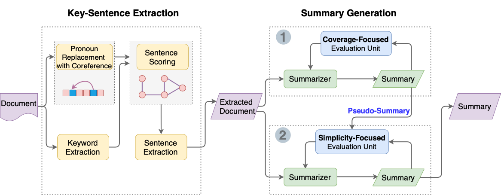

# Introducing Simplicity in Document Summarization by Leveraging Coreference and Pseudo-Summary



## Dependencies
It is highly recommended to create virtual environments with Python 3.8. Due to conflict between libraries, two separated environments may be needed.

- **For phase 1 - Sentence Extraction:** please use libraries listed in the following file
    - `requirements_phase1.txt`
- **For phase 2 - Summary Generation:** please use libraries listed in the following file
  - `requirements.txt`

    
In order to train summarizers in **phase 2 (Summary Generation)**, we leverage with the pre-trained models from [Summary Loop](https://github.com/CannyLab/summary_loop/releases/tag/v0.1), download the following files and place them under ***models*** directory.
- `bert_coverage.bin`: A bert-base-uncased finetuned model on the task of Coverage for the news domain,
- `fluency_news_bs32.bin`: A GPT2 model finetuned on a large corpus of news articles, used as the Fluency model,
- `gpt2_copier23.bin`: A GPT2 model that can be used as an initialization model for the phase2-stage1 summarizer.

Above three models are required for **phase 2 - stage 1 (Coverage-Focused).** 

After stage 1 training is completed, the following models are required for ***phase 2 - stage 2 (Simplicity-Focused)***
- `model checkpoint from stage 1` : This is used as initial model and reference model (must be specified in the argument parser when running the program).
- `fluency_news_bs32.bin` is required for fluency. 


## CNN/Daily Mail Dataset Preparation
Follow the instructions [here](https://github.com/JafferWilson/Process-Data-of-CNN-DailyMail) to download CNN/Daily Mail dataset and place it in the ***data*** directory. Recommand follow Option1. (See discussion [here](https://github.com/abisee/cnn-dailymail/issues/9) about why we do not provide it ourselves). And see to [create a dataset](https://github.com/CannyLab/summary_loop/blob/master/Dataset%20SQLite3%20Example.ipynb) that will be capable with Summary Loop training script. 
1. `cd data`
2. `git clone https://github.com/abisee/cnn-dailymail.git`
3. download CNN_STORIES_TOKENIZED, DM_STORIES_TOKENIZED from [here](https://github.com/JafferWilson/Process-Data-of-CNN-DailyMail) and unzip it
4. `python3 make_datafiles.py`
5. `test_dataset.db` will be create

- You may change the details in the script to create training set accordingly. 
- Otherwise, you can modify the scripts' data loading (`Dataloader`) and collate function (`collate_fn`) to bring in your own data.

## Training Procedure
Once all the pretraining models and data are ready, you can start the training as follows:

1. **Phase 1: Sentence Extraction**
- input: CNN/Daily Mail dataset
- output: Extracted dataset
```
python3 phase1_extract_sentence_coreference.py
```

2. **Phase 2 - Stage 1 Summary Generation (Coverage-Focused)**
- input: Extracted dataset from phase 1 
- output: Summary having high coverage
```
python3 phase2_stage1_train_summarizer_coverage.py --experiment  phase1_checkpoint_name  --dataset_file /home/jacky/research/data/train_extracted_data.db   --initial_summarizer /home/jacky/research/models/gpt2_copier23.bin 
```

3. **Phase 2 - Stage 2 Summary Generation (Simplicity-Focused)**
- input: Extracted dataset from phase 1
- output: Summary having simplicity and coverage
```
python3 phase2_stage2_train_summarizer_simplicity.py --experiment phase2_checkpoint_name   --dataset_file /home/jacky/research/data/train_extracted_data.db --initial_summarizer /home/jacky/research/models/phase1_checkpoint.bin  --referenced_summarizer /home/jacky/research/models/phase1_checkpoint.bin  
```

## Summary Generation
For summary generation, please change the model name in `generate_eval_phase2.py`. Then the summary can be generated and evaluated by running:
```
python3 generate_eval_phase2.py
```

## Phase 1 Evaluation (Optional)
For phase 1 evaluation, please run:
```
python3 eval_phase1.py
```

## Scripts are mainly adapted from
You may refer to the following sources for further information
- Robin's research (NTHU: IDEA LAB): [Boosting Factual Consistency and High Coverage in Unsupervised Abstractive Summarization](https://github.com/s103321048/mywork_backup)
- ACL2020 paper: [The Summary Loop: Learning to Write Abstractive Summaries Without Examples](https://github.com/CannyLab/summary_loop)
